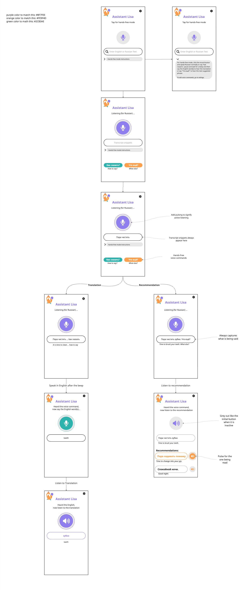

# Assistant Lisa — UI redesign plan

Reference for reworking the single caregiver screen in
[`app/src/main/java/com/botlisa/app/MainActivity.kt`](app/src/main/java/com/botlisa/app/MainActivity.kt)
to match the attached wireframe. This is almost entirely presentation plus a
few new callbacks on the speech/TTS helpers — nothing in the backend,
networking, or trigger‑phrase logic changes.

*In other words: the app keeps doing exactly what it does today. This is a
new coat of paint (colors, the fox, a big mic button, a live transcript) on
top of the same plumbing.*

## Reference images

| Wireframe | Fox logo |
|---|---|
|  |  |


## Palette (from the wireframe legend)

| Role | Hex | Used for |
|---|---|---|
| Purple | `#8F7FEE` | `primary` — title, mic button while listening in Russian, translation speaker |
| Orange | `#FE9F4D` | accent — "Что ещё?" button, the recommendation currently being read |
| Green / teal | `#2CB3AE` | accent — "Как сказать?" button, mic button while listening for the English word |
| Off‑white | `~#F7F7FA` | window background, launcher‑icon background |

---

## Wireframe walkthrough (frame by frame)

1. **Idle / entry (text mode).** Header: fox logo top‑left, "Assistant Lisa"
   title in purple, gear icon top‑right. Centered subtitle "Tap for
   hands‑free mode". Large **grey** circular mic button, inactive. Rounded
   search field with a magnifier icon and placeholder "Enter English or
   Russian Text". Collapsed row: `>` "Hands‑free mode instructions". *Per the
   later feedback:* the teal / orange command items also show here, as
   tappable **buttons** (§3.6).
2. **Instructions expanded.** Same screen, chevron rotated to `v`, a grey
   panel showing the hands‑free instructions paragraph and an italic "To edit
   voice commands, go to settings."
3. **Listening.** Subtitle "Listening (for Russian) …". Mic button **purple**
   and **pulsing**. The shared field sits directly under the button showing
   the live transcript. Below the collapsible instructions row, the two
   read‑only command reminders — teal speech‑bubble **"Как сказать?"** /
   *how to say* and orange lightbulb **"Что ещё?"** / *what else* — an
   icon disc + phrase + caption, not tappable, same in text mode.
   (Implemented; the wireframe's boxed "Quick reminders:" card was dropped —
   see §3.6.)
4. **Listening + captured transcript.** Transcript pill now shows real text
   ("Пора чистить"). Annotation: "Always captures what is being said".
5. **Translate branch — trigger heard.** Transcript pill:
   "Пора чистить … как сказать" with an italic English gloss under it. Caption
   below the frame: "Speak in English after the beep".
6. **Recommendation branch — trigger heard.** Transcript pill:
   "Пора чистить зубки. Что ещё?" with italic gloss "Time to brush your teeth.
   What else?". Caption: "Listen to recommendation".
7. **Translate branch — listening for the word.** Subtitle "Heard the voice
   command, now say the English word(s)…". Mic button **teal**. Pill shows
   "teeth".
8. **Recommendation branch — reading results.** Subtitle "Heard the voice
   command, now listen to the recommendation". Speaker icon **grey/inactive**
   at top. Pill with the phrase + gloss, then a **"Recommendations:"** list:
   each row is a phrase pill with a trailing speaker icon; the one being read
   is **orange and pulsing**, the rest are grey.
9. **Translate branch — reading the translation.** Subtitle "Heard the
   English, now listen to the translation". **Purple** speaker icon (active).
   Pill shows the Russian word ("зубки") with the English caption ("teeth").

> **Deliberate deviation from the wireframe:** the wireframe draws the
> "transcript snippet" pill and the type‑to‑search box as two separate
> elements. We collapse them into **one** rounded field under the mic that is
> both the text input and the live‑transcript display (it already behaves
> this way in code — voice results are written into `input`). See §3.4.

---

## 1. Gap analysis — wireframe vs. current UI

| Wireframe element | Today | Change |
|---|---|---|
| "Assistant Lisa" title, purple, fox logo left, gear right | "Bot Lisa" text + "Settings" `TextButton` | New header row; rename visible title; add logo; gear icon toggles settings |
| Dynamic subtitle (`Tap for hands-free mode` / `Listening (for Russian)…` / `…now say the English word(s)…` / `…now listen to the translation` / `…listen to the recommendation`) | Small state line inside the "Lisa Assistant" card (`Off` / `Listening (Russian)…` / …) | Promote to a centered subtitle driven by a richer UI‑phase state |
| Large central mic button — grey → purple → teal, pulsing while listening | Mic is a tiny trailing icon on the input; on/off is a `Start`/`Stop` text button | New `AssistantButton` composable: big circle, color per phase, infinite‑transition pulse |
| Transcript "pill" under the mic ("Пора чистить зубки. Что ещё?") + italic English gloss | Each recognised utterance is already written into the visible input field (`input = text` in `handleAssistantUtterance` / the one‑shot mic) and echoed in the result card as `"${r.input}"`. Missing: it is not positioned under the mic, no partial/streaming updates (partial results disabled), no English gloss, and the command phrases (`как сказать` / `что ещё?`) never land there (consumed as triggers first) | **Keep it one shared field** — the same rounded search box is both the type‑to‑search input and the voice‑transcript display. Move that field directly under the mic, add an `onTranscript` callback so it also shows partials + command phrases, and render the gloss as a caption line beneath it. No separate pill component. |
| Collapsible "Hands-free mode instructions" with chevron | Instructions always visible as body text in the card | Collapsible section (`AnimatedVisibility`); **new copy** (see §7) with command phrases **bold** |
| Teal "Как сказать?" + orange "Что ещё?" command items | Spoken triggers documented only in the instructions blob | `CommandChips` (§3.6): two **read‑only reminders** (icon disc + coloured phrase + italic caption), identical in every mode, not tappable. Hands‑free: shown until a command is used, back on new input. Text mode: shown only while the field is blank (Search key does the lookup). Both label lines come from the Settings trigger‑phrase fields for `targetLanguage` (`TriggerPhraseConfig`) — bold phrase + an on‑device `targetLanguage`→English caption (not hard‑coded Russian) — and update live. |
| Result: purple speaker icon + big Russian word + English caption | Text‑only "Translation:" block with source/latency line | Restyle; add speaker icon that pulses while TTS speaks |
| Recommendations: list of phrase pills each with a speaker icon; the one being read is orange + pulsing | Bulleted `• phrase / gloss` list, no per‑item audio | Pill list with trailing speaker `IconButton`; track "currently speaking" index |
| Search‑style input: rounded, magnifier icon, "Enter English or Russian Text" | `OutlinedTextField` with label + mic trailing icon + separate "Look up" button | Restyle as a rounded search field; submit on IME action; drop the separate button and the one‑shot mic icon |
| Colors `#8F7FEE` / `#FE9F4D` / `#2CB3AE` | Bare `MaterialTheme {}` (system default purple) | New `BotLisaTheme` with a real `ColorScheme` |
| Fox app icon | `@android:mipmap/sym_def_app_icon` | Add the fox as an adaptive launcher icon + in‑app logo |

---

## 2. Theme & assets (new)

- **`ui/Theme.kt`** — `BotLisaTheme` wrapping `MaterialTheme` with a
  `lightColorScheme` (and a matching `darkColorScheme` if we want dark
  support): `primary = #8F7FEE`, `secondary` / `tertiary = #FE9F4D` and
  `#2CB3AE`, plus sensible `onPrimary` / container roles. Wire it in
  [`MainActivity.onCreate`](app/src/main/java/com/botlisa/app/MainActivity.kt#L68-L77)
  in place of the bare `MaterialTheme {}`.
- **[`res/values/themes.xml`](app/src/main/res/values/themes.xml)** — change
  the base to a `DayNight.NoActionBar` parent with the off‑white
  (`~#F7F7FA`) window background.
- **Fox logo asset** — save the source PNG as
  `res/drawable-nodpi/lisa_fox.png`; render in the header via
  `Image(painterResource(...))` at ~32–40 dp.
- **Launcher icon** — `mipmap-anydpi-v26/ic_launcher.xml` +
  `ic_launcher_round.xml` adaptive icon: foreground = fox (scaled ~66 %),
  background = solid `#F7F7FA`. Point `android:icon` / `android:roundIcon` in
  [`AndroidManifest.xml`](app/src/main/AndroidManifest.xml#L10) at it.
- **[`res/values/strings.xml`](app/src/main/res/values/strings.xml)** — add
  `assistant_title` = "Assistant Lisa"; optionally change `app_name` too
  (see §8). Package stays `com.botlisa.app`.

No new Gradle dependencies — `material-icons-extended` (Search, Settings,
VolumeUp, ExpandMore) and the animation APIs are already on the classpath via
the Compose BOM.

---

## 3. Screen rewrite — [`LisaScreen()`](app/src/main/java/com/botlisa/app/MainActivity.kt#L82)

Still one scrolling `Column`, tighter spacing to match the mock.

1. **Header** — top `Row` with the fox `Image` at the left and a gear
   `IconButton(Icons.Filled.Settings)` at the right (toggles
   `showServerSettings`); then `Text("Assistant Lisa", color = primary,
   textAlign = Center)` **centered on its own line** beneath that row (bold,
   ~headlineMedium), as in the mock. Removes the "Bot Lisa" / "Hide
   settings" row at
   [L349‑L358](app/src/main/java/com/botlisa/app/MainActivity.kt#L349-L358).
   **Tapping the fox** calls `resetToStart()` — stops hands‑free, clears
   field focus (`focusManager.clearFocus()`, so the "start typing" helper
   isn't suppressed), and clears the field, result, errors, and any open
   panels (persistent settings — server, language, trigger phrases — are
   left alone).
2. **Subtitle** — centered `Text`, value from the new `uiPhase` (below).
   Replaces the descriptive paragraph at
   [L359‑L363](app/src/main/java/com/botlisa/app/MainActivity.kt#L359-L363).
3. **`AssistantButton(uiPhase, onClick = ::onToggleAssistant)`** — new
   composable in `ui/AssistantButton.kt`. Circle ~84 dp; `Mic` icon in
   listening phases, `VolumeUp` icon in speaking phases; fill color
   grey / purple / teal per phase; `rememberInfiniteTransition` scaling a
   ring behind it while the phase is a "listening" or "reading" one. Absorbs
   the current `Start`/`Stop` `Button` at
   [L387‑L389](app/src/main/java/com/botlisa/app/MainActivity.kt#L387-L389);
   `onToggleAssistant()`
   ([L326‑L340](app/src/main/java/com/botlisa/app/MainActivity.kt#L326-L340))
   is reused as‑is.
4. **Shared input / transcript field** — one rounded search field, directly
   under the mic button, that serves **both** roles:
   - *Type‑to‑search:* `leadingIcon = Icons.Filled.Search`, placeholder
     "Enter English or Russian Text",
     `KeyboardOptions(imeAction = ImeAction.Search)`,
     `keyboardActions = KeyboardActions(onSearch = { onSend() })`. Drops the
     old mic trailing icon and the separate "Look up" `Button` at
     [L470‑L491](app/src/main/java/com/botlisa/app/MainActivity.kt#L470-L491).
   - *Voice transcript:* the recognised text is written into the **same**
     `input` state — this already happens in `handleAssistantUtterance`
     ([L285‑L288](app/src/main/java/com/botlisa/app/MainActivity.kt#L285-L288));
     the new `onTranscript` callback (§4) additionally routes partial
     results and the command phrases (`как сказать` / `что ещё?`) into it so
     it updates live while listening. After `onSend()` the text stays in the
     field (as today) until the next utterance or a manual edit.
   - *English gloss:* optional italic caption line **beneath** the field
     (not inside it), shown only when a gloss is available. Deferred — see
     §8.
   - Style it as a pill (`shape = CircleShape`/large corner) so it reads as
     the wireframe's "transcript snippet" while listening and as a search box
     when idle. Keep `LinearProgressIndicator` under it for the loading
     state.
   No separate pill composable and no `lastTranscript` state — `input` is the
   single source of truth for both typed and spoken text.

   **Field ownership (typing vs. transcript).** The field has one owner at a
   time so the two writers never fight:
   - *Hands-free OFF* → **caregiver** owns it: plain editable text box, the
     transcript never touches it.
   - *Hands-free ON, field not focused* → **assistant** owns it: shows the
     live transcript; ideally rendered muted/italic so it reads as "being
     heard", not "typed".
   - *Hands-free ON, field focused / a key pressed* → ownership flips back to
     **caregiver**; transcript writes are suppressed until focus is lost
     (submit or tap away), then the assistant resumes.
   - Never discard the transcript when the caregiver holds the field — show
     it in the placeholder / a small secondary line so they can see the mic
     is still working.

   *Status:* the **focus guard** is implemented (`inputFocused` from
   `Modifier.onFocusChanged` gates `handleTranscript` alongside
   `assistantState != IDLE`), and the **muted styling** while the assistant
   owns the field is done (Step 8 — `assistantOwnsField` → the field's
   `textStyle` goes italic + `onSurfaceVariant`). The **secondary line**
   (keep the transcript visible when the caregiver takes focus) is still
   optional.

   **Grace period before auto-send — tried in 7b, then removed.** A 1.5 s
   `scheduleAutoSend` delay + "Heard you — tap to edit" prompt was built and
   reverted: the user wanted the lookup to fire immediately with no
   notification. `handleAssistantUtterance` is back to `input = text;
   onSend()`. If a "fix a misheard word" affordance is wanted later it should
   be non-blocking (e.g. an undo/edit on the *result*, not a pre-send hold).
5. **Collapsible instructions** — a filled lavender pill `Surface`
   (`clickable`) with a leading sparkle icon (`Icons.Filled.AutoAwesome`),
   the label "Hands‑free mode instructions", and a trailing chevron
   (`Icons.Filled.ExpandMore`, rotate 180° when open) + an
   `AnimatedVisibility` panel below it containing the **new copy** in §7,
   with the command phrases rendered **bold**. Replaces the always‑on text
   at
   [L391‑L396](app/src/main/java/com/botlisa/app/MainActivity.kt#L391-L396).
   New `var showInstructions by rememberSaveable { mutableStateOf(false) }`.
6. **Command chips** — two **read‑only reminders**, identical in every mode:
   a circular icon disc (faint tinted fill, no outline ring) + the coloured
   phrase in bold + the italic English caption below. Not tappable — they're
   a mnemonic for the two spoken commands, nothing more.
   - Icons: teal speech‑bubble (`Icons.AutoMirrored.Filled.Chat`) for
     "Как сказать?", orange lightbulb (`Icons.Filled.Lightbulb`) for
     "Что ещё?".
   - No hint text, no buttons, no script‑aware enablement. In text mode a
     lookup is done with the keyboard's **Search** key; in hands‑free with
     the spoken triggers.

   **Visibility** — `CommandChips(visible = …)` from MainActivity:
   - **Hands‑free** (`assistantState != IDLE`): `!commandsDismissed`.
     `commandsDismissed` is driven by `LaunchedEffect(assistantState)` →
     `(assistantState == LISTENING_FOR_WORD)` — hidden only mid
     translate‑command; any move to `IDLE` / `LISTENING_DEFAULT` (incl.
     starting / restarting hands‑free) clears it. The spoken "что ещё?"
     (`handleNextSuggestionRequest`) also sets it `true`; a fresh utterance
     (`handleAssistantUtterance`) clears it.
   - **Text mode** (`assistantState == IDLE`): shown **only while the field
     is blank**. As soon as the caregiver types, they hide (Search does the
     job). They reappear when the field is cleared, e.g. via the fox reset.

   **Labels — both lines come from Settings and follow the target language,
   nothing hard‑coded:**
   - Bold line: the stored `translateTriggerPhrase` /
     `nextSuggestionTriggerPhrase` for **`targetLanguage.code`** (the fields
     the caregiver edits in §3.8, persisted by
     [`TriggerPhraseConfig.kt`](app/src/main/java/com/botlisa/app/TriggerPhraseConfig.kt),
     which is already keyed by language). `MainActivity` today passes
     `SupportedLanguages.RUSSIAN.code` to these getters/setters
     ([L118‑L131](app/src/main/java/com/botlisa/app/MainActivity.kt#L118-L131))
     — switch that to `targetLanguage.code` so the phrase shown (and edited)
     is the one for the selected language. Keep them as `remember`ed state
     hoisted in `LisaScreen`, re‑read when `targetLanguage` changes, so the
     chips re‑render live. Display‑format: capitalise first letter + append
     "?"; keep the raw string for matching.
   - Italic caption: an **on‑device translation of that same phrase from
     `targetLanguage` → English** (see §4), re‑translated whenever the
     caregiver edits the phrase or switches language. While the translation
     is pending (first‑use model download) or if it fails, fall back to a
     generic "how to say" / "what else". The caption runs through the **same
     `formatCommand`** (leading capital + "?") as the bold phrase, so
     "how to say" renders as *How to say?* — matching the Russian button.

   > Note: Lisa Assistant's continuous‑listening STT locale and the
   > related‑phrase/expand mode are still Russian‑only in the backend (see
   > the README "Known limitations") — generalising *those* is the separate
   > larger change. This item only makes the **chip's displayed phrase +
   > caption** follow `targetLanguage`, which needs no backend work.
7. **Result card** — rework
   [L501‑L546](app/src/main/java/com/botlisa/app/MainActivity.kt#L501-L546):
   - *Done already:* `onSend()` clears `result` at the start, so the old
     card disappears the moment a new lookup (typed or spoken) begins instead
     of lingering under a stale answer. And the "Related phrases:" heading
     only renders when `r.related` is non‑empty; an empty list shows a
     *"No related phrases for \"…\"."* line instead of a bare heading. The
     `• phrase / gloss` rows are factored into a `RelatedPhraseList`
     composable.
   - *Done (7a):* translate mode is a `Row` of a speaker `IconButton`
     (pulses via `Modifier.pulse()` while `translationSpeaking`, tap
     re‑speaks through `speaker`) + `translation.ru` (`headlineSmall`) +
     `"input"` italic. `source · latencyMs` line dropped.
   - *Done (7a):* related phrases render as `RelatedPhraseList` rows —
     `Surface` (secondary‑tinted when active) wrapping
     `Row(Column(ru + gloss).weight(1f), trailing speaker IconButton)`. The
     row whose index `== speakingIndex` is highlighted and its icon pulses.
     `speakRelated(i)` sets `speakingIndex = i` + `suggestionIndex = i + 1`
     and speaks via `russianSpeaker`; `speakNextSuggestion()` also sets
     `speakingIndex`. `TranslationSpeaker` now takes an `onSpeakingChanged`
     callback (via `UtteranceProgressListener`, posted to the main thread);
     `russianSpeaker`'s clears `speakingIndex` when playback ends.
   - *Removed:* the 7b grace period before auto-send — the user preferred an
     immediate lookup, no "Heard you" prompt. See §3.4.
8. **Settings panel** — unchanged content (target language, two trigger
   fields, server URL, API key at
   [L403‑L468](app/src/main/java/com/botlisa/app/MainActivity.kt#L403-L468));
   just now revealed by the gear icon. The two **"Trigger phrase"** fields
   here are the single source of truth for the voice commands: they drive
   the quick‑reminders card (§3.6), the bold phrases in the instructions
   copy (§7), and the actual match logic in `SpeechAssistant`. No behaviour
   change to these fields — only their downstream display gets richer.
   Optionally move the whole panel into its own `Dialog` in the polish step
   (see §8).

### New state in `LisaScreen`

```kotlin
// `input` (existing) is the single source of truth for BOTH typed text and
// voice transcript — no separate transcript state.
var showInstructions by rememberSaveable { mutableStateOf(false) }
var transcriptGloss by remember { mutableStateOf<String?>(null) } // italic line under the field; null until available
var commandsDismissed by remember { mutableStateOf(false) }        // §3.6: hide chips after a command is used, until new input
var cmdCaptions by remember { mutableStateOf<Pair<String?, String?>>(null to null) } // §3.6: targetLanguage→EN of the two trigger phrases
var speakingIndex by remember { mutableStateOf<Int?>(null) }
var isSpeaking by remember { mutableStateOf(false) }
// uiPhase: derived from assistantState + isSpeaking + result?.mode
```

`uiPhase` is a small `enum` (`IDLE`, `LISTENING_RU`, `LISTENING_EN`,
`SPEAKING_TRANSLATION`, `READING_RECOMMENDATION`) computed with
`derivedStateOf` and consumed by the subtitle + `AssistantButton`.

---

## 4. Supporting‑class changes

- **[`SpeechAssistant.kt`](app/src/main/java/com/botlisa/app/SpeechAssistant.kt)**
  - Add constructor param `onTranscript: (String) -> Unit` and call it from
    `onResults`
    ([L145‑L151](app/src/main/java/com/botlisa/app/SpeechAssistant.kt#L145-L151))
    — and optionally from `onPartialResults` after enabling
    `EXTRA_PARTIAL_RESULTS`. The callback writes into the shared `input`
    field (§3.4), which is what makes the command phrases (`как сказать` /
    `что ещё?`) visible — today they never reach `input` because they are
    consumed as triggers before `handleAssistantUtterance` runs. Partial
    results are what make it feel "live"; the final‑only transcript already
    flows to `input` today.
  - *No `enterTranslateMode()`* — the command chips (§3.6) are only
    interactive in text mode, where "teal" just runs the normal `onSend()`
    translate path; they never need to push `SpeechAssistant` into
    `LISTENING_FOR_WORD` from the UI. The spoken phrase match at
    [L121‑L124](app/src/main/java/com/botlisa/app/SpeechAssistant.kt#L121-L124)
    stays the only way in.
  - *No new callback for chip dismissal* — §3.6 hides the chips on
    `assistantState == LISTENING_FOR_WORD` (teal phrase heard) and inside
    the existing `onNextSuggestionRequested` handler (orange phrase heard).
    Both signals already exist.
  - *`isMuted: () -> Boolean` param (done)* — while the app's own
    TextToSpeech is playing (`translationSpeaking || relatedSpeaking`), the
    recogniser's `onResults` / `onPartialResults` discard the audio (still
    re‑arm). Without this the mic transcribes the assistant reading a
    suggestion aloud and re‑sends it as a query. `TranslationSpeaker.speak()`
    now returns `Boolean`; `speakRelated` / `speakNextSuggestion` only claim
    the row + advance `suggestionIndex` when playback actually started.
- **[`OnDeviceTranslator.kt`](app/src/main/java/com/botlisa/app/OnDeviceTranslator.kt)**
  - The command‑chip captions (§3.6) and the transcript gloss (§3.4) need
    **`targetLanguage` → English**, but this object currently only does
    English → `targetLanguage`. Add a reverse path — ML Kit `Translation`
    supports arbitrary language pairs, so it is a `Translator` client with
    `sourceLanguage = targetLanguage.mlKitCode, targetLanguage = ENGLISH`
    (keyed/cached per source language; each pair has its own one‑time
    ~30 MB model download, wifi on first use, offline after). Do **not**
    hard‑code Russian as the source — when `targetLanguage` is Russian the
    pair is RU→EN, when it is Spanish it is ES→EN, etc. Cache translated
    strings per (source lang, input); the two trigger phrases change rarely
    so this stays a couple of entries per language.
- **[`TranslationSpeaker.kt`](app/src/main/java/com/botlisa/app/TranslationSpeaker.kt)**
  - Set an `UtteranceProgressListener` on `tts` and add
    `onStart` / `onDone` / `onError` callbacks (or a
    `StateFlow<Boolean> speaking`) so the UI can pulse the speaker icon and
    show the "…now listen to the translation" subtitle only while audio is
    actually playing. `speak()` already tags utterances with an id
    ([L48](app/src/main/java/com/botlisa/app/TranslationSpeaker.kt#L48)).
- **[`ApiClient.kt`](app/src/main/java/com/botlisa/app/ApiClient.kt) / backend**
  — no change.

---

## 5. New files

- `ui/Theme.kt` — `BotLisaTheme`, color schemes, typography tweak (purple
  title).
- `ui/AssistantButton.kt` — pulsing circular mic / speaker button.
- `ui/CommandChips.kt`, `ui/RecommendationList.kt` — optional extraction to
  keep `MainActivity.kt` readable (it is ~550 lines now). No
  `TranscriptPill.kt` — the shared search field (§3.4) covers it.
  `CommandChips.kt` takes the two phrases, their `targetLanguage`→EN
  captions, a `mode` (`BUTTON` / `REMINDER`), a `visible` flag, and two
  `onClick`s (ignored in `REMINDER` mode).
- `Pulse.kt` — `Modifier.pulse(active)` for the result-card speaker icons.
- `InstructionsPanel.kt` — the collapsible hands-free instructions strip.
- `ThemeConfig.kt` — persisted dark-mode override (`Boolean?`, null = system)
  for the Settings toggle.
- `res/drawable-nodpi/lisa_fox.png`, `res/mipmap-anydpi-v26/ic_launcher*.xml`,
  `res/values/colors.xml`.
- Edits: `res/values/themes.xml`, `res/values/strings.xml`,
  `AndroidManifest.xml`.

> Actual layout note: these live flat in `com.botlisa.app`, not a `ui/`
> subpackage, matching the existing files.

---

## 6. Suggested build order

Each step leaves the app buildable.

1. **Theme + fox + rename** — `Theme.kt`, colors wired in `setContent`,
   launcher icon, "Assistant Lisa" title. Immediately visible, low risk.
2. **Header + gear + dynamic subtitle** — new top row, `uiPhase` enum,
   settings behind the gear.
3. **AssistantButton** — big pulsing button, retire `Start`/`Stop`.
4. **Shared input / transcript field** — restyle as the rounded search box
   under the mic, IME submit, drop "Look up" + old mic icon; add the
   `onTranscript` callback so partials + command phrases flow into `input`
   too, gated by `assistantState != IDLE` **and** the focus guard (§3.4).
   English gloss line + muted styling deferred (Step 8). (A grace period
   before auto-send was tried in 7b and reverted — §3.4.)
5. **Collapsible instructions** — new copy, bold commands.
6. **Command chips** — `CommandChips.kt`: two read‑only icon‑disc reminders,
   identical in every mode, not tappable. Hands‑free → `commandsDismissed`
   lifecycle; text mode → shown only while the field is blank. No buttons,
   hint, or script logic. Still pending: `targetLanguage`→EN captions via the
   new `OnDeviceTranslator` reverse path (source language is `targetLanguage`,
   not hard‑coded Russian).
7. **Result / recommendations rework** *(done)* — speaker icons
   (`UtteranceProgressListener` → `Modifier.pulse`), currently‑speaking
   highlight + pulse, per‑phrase tap‑to‑hear. (A grace period before
   auto-send was tried and reverted — see §3.4.)
8. **Polish** —
   - *Done:* full **dark scheme** in `Theme.kt` (neutrals for both light and
     dark; the three brand hues shared). Muted **assistant-owned field**:
     while hands-free is running, the field is unfocused, and it holds
     transcript text, the field text renders italic + `onSurfaceVariant`
     (`assistantOwnsField` → `textStyle`), so it reads as "being heard".
   - *Still optional:* pixel spacing against the mock, settings-as-`Dialog`,
     and the §3.4 secondary line that keeps the transcript visible when the
     caregiver takes focus.

Steps 1–7 are largely independent; 8 is the biggest single chunk.

---

## 7. Hands‑free instruction copy (replaces the old text)

Shown in the collapsible "Hands‑free mode instructions" panel (frame 2) and
nowhere else. The **command phrases are bold** in the app. When the user has
customised a trigger phrase in Settings, the bold text is that custom phrase,
not the literal default — build it from `translateTriggerPhrase` /
`nextSuggestionTriggerPhrase`.

> **Hands‑free mode:**
> - Tap the mic, then speak Russian normally
> - To translate a word: say **как сказать**, pause and wait for the beep, then say the English word
> - To hear the next suggestion: say **что ещё?**
>
> To edit voice commands, go to settings.

### Compose rendering

```kotlin
val instructions = buildAnnotatedString {
    append("Hands-free mode:\n")
    append("• Tap the mic, then speak Russian normally\n")
    append("• To translate a word: say ")
    withStyle(SpanStyle(fontWeight = FontWeight.Bold)) { append(translateTriggerPhrase) }
    append(", pause and wait for the beep, then say the English word\n")
    append("• To hear the next suggestion: say ")
    withStyle(SpanStyle(fontWeight = FontWeight.Bold)) { append(nextSuggestionTriggerPhrase) }
    appendLine()
    appendLine()
    append("To edit voice commands, go to settings.")
}
Text(instructions, style = MaterialTheme.typography.bodySmall)
```

> **"Wait for the beep"** — the copy promises an audible cue when the app
> switches to listening for the English word. There is no beep today; add a
> short `ToneGenerator` blip (or a `TextToSpeech` earcon) in the
> translate‑trigger branch of `SpeechAssistant`
> ([L121‑L124](app/src/main/java/com/botlisa/app/SpeechAssistant.kt#L121-L124)),
> just before it re‑arms into `LISTENING_FOR_WORD`, or soften the wording.

---

## 8. Decisions to confirm (defaults chosen)

- **App label** — rename the on‑screen title to "Assistant Lisa" only, or
  also `app_name` (home‑screen label)? *Default: rename both; package stays
  `com.botlisa.app`.*
- **English gloss under the shared field** ("Time to brush your teeth. What
  else?") — showing it live needs on‑the‑fly `targetLanguage`→English
  translation of the transcript (ML Kit can, per‑pair model download on
  first use; source is `targetLanguage`, not hard‑coded Russian). *Default:
  ship the field with raw transcript now, add the gloss caption line as a
  follow‑up.*
- **One field for typed + spoken text** — *Decided & partly built:* one
  shared rounded field under the mic (§3.4). The **focus guard is done** —
  `onTranscript` writes to `input` only while `assistantState != IDLE` **and**
  the field is not focused for typing. Still open, per the ownership model in
  §3.4: (a) muted/italic styling while the assistant owns the field —
  **done** (Step 8, `assistantOwnsField` → `textStyle`); (b) a secondary
  line so the transcript stays visible when the caregiver has focus — still
  optional. (The grace-period-before-auto-send was tried in 7b and reverted
  — the user wanted an immediate lookup.)
- **One‑shot dictation** — the wireframe drops the "Look up" button and the
  input's mic icon. *Default: keep typing as a fallback that submits on the
  keyboard's Search action; remove the standalone one‑shot `speechLauncher`
  mic (the big button is the mic now).*
- **Settings** — inline expanding section (current) vs. a dedicated dialog /
  screen. *Default: inline for now, dialog in the polish step.*
- **Command chips (§3.6)** — *Decided:* two read‑only reminders, identical
  in every mode; hands‑free shows them until a command is used (restored on
  new input), text mode shows them only while the field is blank. **Both**
  label lines (bold phrase + italic caption) track the Settings trigger
  phrases **for `targetLanguage`**, the caption via on‑device
  `targetLanguage`→English (never hard‑coded Russian). Open sub‑questions:
  - *Model download* — the caption needs ML Kit's `targetLanguage`→English
    model (~30 MB per language, wifi once). *Default: show the generic
    "how to say" / "what else" fallback until it downloads; never block the
    UI on it.*
  - *"New input" that restores the chips* — *Default: any new non‑blank
    `input` from typing, or any new default‑mode utterance. A bare partial
    transcript does not count until it finalises.*
- **Dark theme** — *Done:* both schemes tuned (`Theme.kt`), plus a
  **Settings "Dark mode" toggle** — `ThemeConfig` stores `Boolean?` (null =
  follow system), read above `BotLisaTheme` in `setContent`; `LisaScreen`
  takes `isDark` / `onToggleDark` and shows a `Switch` in the settings
  panel.
- **Beep** — add a real audible cue vs. reword the instructions. *Default:
  add a short tone in step 6.*

---

## 9. Future features (deferred)

- **Voice-source distinction / speaker separation.** Today the mic is muted
  outright while the app's own TextToSpeech plays (`isMuted` in
  `SpeechAssistant`), because the recogniser would otherwise transcribe the
  assistant's spoken suggestion and re-send it as a query. A better version:
  when **multiple voices are heard**, tell them apart and act only on the
  caregiver's.
  - *Near-term step (no ML):* keep the mic live during playback and use
    **content + timing correlation** — fuzzy-match each transcript against
    the phrase currently being spoken (we already know its text) within the
    playback window + a short tail; drop matches as echo, accept everything
    else. Preserves barge-in (the caregiver can talk over the assistant).
    Could reuse `TriggerPhraseDetector`'s fuzzy match.
  - *Full version:* raw `AudioRecord` → WebRTC/Speex **acoustic echo
    cancellation** fed the TTS as the reference signal → an **offline**
    recogniser (Vosk / whisper.cpp — the system `SpeechRecognizer` can't be
    fed audio). Optionally a speaker-embedding model (cf. `speech_lab/`'s
    SpeechBrain) to enrol the caregiver's voice and the TTS voice and route
    per speaker. This is the "smart-speaker barge-in" architecture and a
    real project; it also enables ignoring a *second human* in the room.
  - *Cheap mitigation that already helps:* route TTS to an earbud so the
    open mic never hears it (matches the app's one-earbud use case) — the
    echo problem largely disappears and the blunt mute becomes a fallback.
  - Not viable: there is no Android API that tags recognised audio as "the
    phone's own voice."
